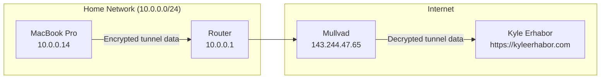
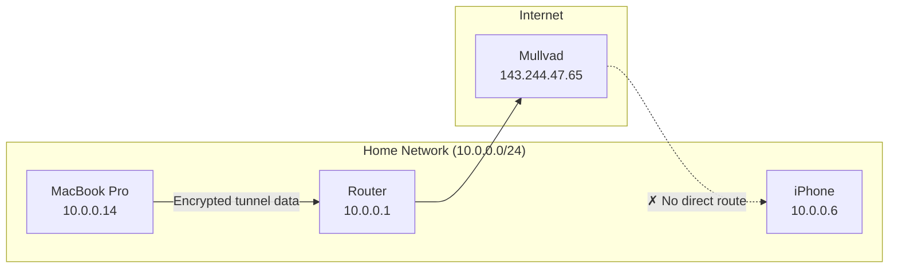
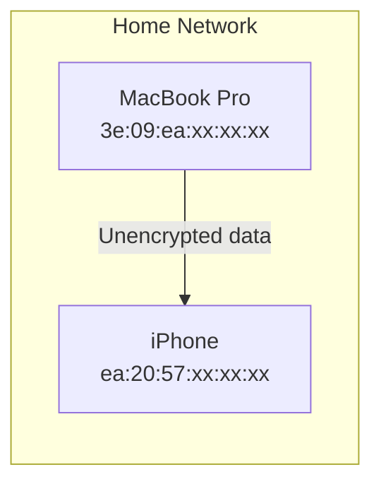
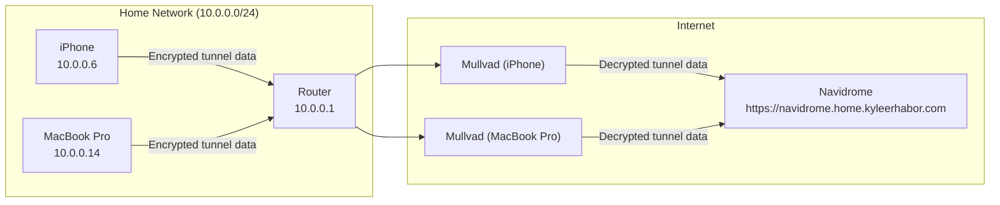
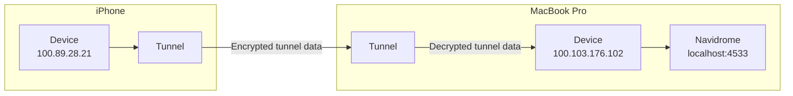
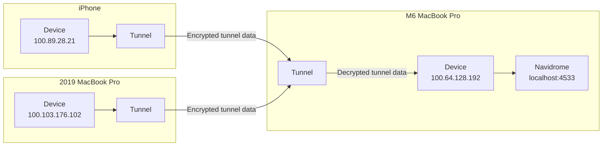
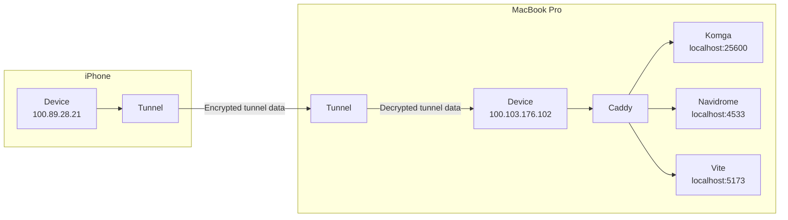
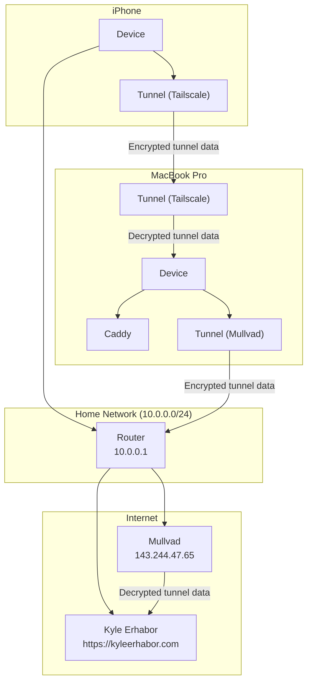

# Tailscale, Mullvad, and avoiding the $5 add-on: a case study in secure networking

In [my previous article about using Nix to manage project dependencies in Swift](https://kyleerhabor.com/articles/using-nix-to-manage-swift-project-dependencies), I very briefly touched on [Tailscale, a VPN service](https://tailscale.com):

> A few days before writing this, I was configuring my system to support secure connection between my MacBook Pro and iPhone over the local network with Tailscale. I was able to use [Caddy](https://caddyserver.com) as a reverse proxy to access services like [Navidrome](https://www.navidrome.org) and [Komga](https://komga.org) at `https://*.home.kyleerhabor.com` as an alternative to port numbers. The best part is that [I accomplished this with very little setup using Nix](https://github.com/kyleerhabor/nix-config/blob/7348b8e6dfe4d50d7b2eddf7f4c4d818d74f4b43/home/kyleerhabor.nix#L37-L75), so apart from Tailscale, Nix manages the dependencies and server processes in a way that works on any system.

Since publishing this, [I’ve updated my configuration to support multiple hosts with multiple servers](https://github.com/kyleerhabor/nix-config/tree/6dddf51638af62695081dafaf16e041256ea7bbe), so my 2019 MacBook Pro can host Navidrome at `https://navidrome.mbp2019.home.kyleerhabor.com`, and a future device like an M6 MacBook Pro could host Komga at `https://komga.mbp2026.home.kyleerhabor.com`. This is nice, but I assume most people are unfamiliar with the various technologies and the issues they’re addressing, so I want this article to be a gentle introduction to what this enables.

If you learned about computer networks through a college course or other means like [Ben Eater’s series](https://www.youtube.com/playlist?list=PLowKtXNTBypH19whXTVoG3oKSuOcw_XeW), you likely came out with an understanding of the basics, and not how to apply what you learned. I’d like to explore one application combining Tailscale and [Mullvad](https://mullvad.net) to securely connect my MacBook Pro and iPhone across any network. Notably, this will integrate with macOS’s VPN settings using [WireGuard's app](https://www.wireguard.com) to support both VPNs running simultaneously.

## The case for Internet VPNs

When you connect to a server, your data is transferred through a network. For local network access (Wi-Fi, Ethernet, etc.), your network administrator manages it (you at home, IT at work, etc.). For Internet access, your Internet Service Provider (ISP) manages it. Each can set policies that impact your ability to make connections across networks. For example, your ISP may inject trackers into unencrypted traffic on the websites you visit, while your school may block certain websites and protocols. An Internet VPN circumvents such restrictions, which is why I use one. Unfortunately, [most services are sketchy](https://www.youtube.com/watch?v=WVDQEoe6ZWY), so I recommend people limit themselves to ones like Mullvad and [IVPN](https://www.ivpn.net/en).

You can see VPNs in action from how they route your traffic. This command uses [STUNTMAN](https://www.stunprotocol.org) to compare my local and mapped IPv4 address:

```sh
stunclient stun.cloudflare.com 3478 --family 4
```

Without my VPN:

```txt
Binding test: success
Local address: 10.0.0.14:57099
Mapped address: xxx.xxx.xxx.xxx:57099
```

With my VPN:

```txt
Binding test: success
Local address: 10.74.58.18:60125
Mapped address: 143.244.47.74:60125
```

To guard against [IPv4 address exhaustion](https://en.wikipedia.org/wiki/IPv4_address_exhaustion), [network address translation (NAT)](https://en.wikipedia.org/wiki/Network_address_translation) is used to limit the number of public addresses from one for each device to one for the whole network. Without my VPN, it’s mapped by my router. With my VPN, it’s mapped by the VPN server. Given this, I’ve redacted my non-VPN mapped address because it represents my home network, which can be used to identify my general location. We can run the same command for IPv6:

```sh
stunclient stun.cloudflare.com 3478 --family 6
```

Without my VPN:

```txt
Binding test: success
Local address: xxxx:xxxx:xxxx:xxxx:xxxx:xxxx:xxxx:xxxx.55611
Mapped address: xxxx:xxxx:xxxx:xxxx:xxxx:xxxx:xxxx:xxxx.55611
```

With my VPN:

```txt
Binding test: success
Local address: fc00:bbbb:bbbb:bb01::b:3a11.51805
Mapped address: 2a02:6ea0:c43f::e015.51805
```

Unlike IPv4’s 32-bit address space, IPv6 uses 128 bits, eliminating the need for NAT. The first 64 bits represent my home network, while the last 64 represent my host device. The two make my device identifiable, which is why I’ve redacted it. As a privacy benefit, my VPN runs NAT to limit the address being used as a tracker. In total, accessing the Internet looks like so:



A nice way to think about what’s going on is that the VPN client encapsulates its connection in a standard one so the server can forward the tunnel data outside the local network. The router receives data sourced from `10.0.0.14` and addressed to `143.244.47.65`, which itself contains data sourced from `10.74.58.18` and addressed to the destination (as a fun exercise, run `host kyleerhabor.com` to discover its addresses). The router forwards this to Mullvad’s server which unwraps the tunnel data, decrypts it, and transfers it to the destination. This can be partially inferred from the tunnel configuration Mullvad generates:

```ini
[Interface]
PrivateKey = <elided>
Address = 10.74.58.18/32, fc00:bbbb:bbbb:bb01::b:3a11/128
DNS = 100.64.0.7

[Peer]
PublicKey = IzqkjVCdJYC1AShILfzebchTlKCqVCt/SMEXolaS3Uc=
AllowedIPs = 0.0.0.0/0, ::/0
Endpoint = 143.244.47.65:51820
```

Here, we can see my local IP addresses, DNS resolver, and the server to use for tunneling. The server's IP address doesn't match my mapped address, but they share the same `/24` subnet of `143.244.47.xxx` (recall that a device can have multiple addresses). This works for accessing the Internet after the tunnel has been established, but not for the home network because Internet VPNs don’t route between their clients and local addresses. For example, if my iPhone ran a server on port 50000, my MacBook Pro couldn’t access it: 



The VPN server can’t route to my iPhone without passing through the router. If it tried to, the tunnel data would have to be decrypted before it reaches the router, allowing anyone on my home network to read my traffic. This defeats the purpose of using a VPN, [so services like Mullvad allow you to access the local network by routing traffic outside the tunnel](https://mullvad.net/en/help/using-mullvad-vpn-app#lan-share), making it visible:



This may be fine if you trust the network, but recall that you may connect to various networks. I have a Navidrome server running on my MacBook Pro at port 4533. If I login from my iPhone, not only will my credentials pass through the network unencrypted, but so will the token used for authentication. That is, it’s not a one-time cost, despite what some password fields would have you believe. This is why it’s important to enable encryption for server connections. The typical solution is to purchase a domain name, set up certificates, and run the server on dedicated hardware to make it available over the Internet:



This works, but exposes the server to the Internet, which may be unwanted for a server that shouldn’t be public (e.g., you have to keep it up-to-date for security patches). What we really want is a way to access the server in a private network only select devices know how to access, while also encrypting the traffic without relying on [self-signed certificates](https://en.wikipedia.org/wiki/Self-signed_certificate). In other words, we want our connections to look more like this:



This is the kind of issue mesh VPNs like Tailscale aim to address.

## The case for mesh VPNs

As previously established, Internet VPNs secure traffic destined for the Internet from the local network, but can’t do so for the local network because the server would have to transfer the decrypted tunnel data through it, defeating the purpose of using a VPN. The natural solution is to tunnel each device so only they can read the traffic, [which is how Tailscale works](https://tailscale.com/blog/how-tailscale-works). Tailscale associates devices in a private network and uses WireGuard for tunneling. The service supports many devices, so if I wanted to host Navidrome elsewhere (e.g., on a future M6 MacBook Pro or dedicated hardware), it’s just one more addition:



Notice that my 2019 MacBook Pro and iPhone transfer data to the same M6 MacBook Pro, but don’t transfer between each other. This allows connections to be end-to-end encrypted, preventing other devices in the network from reading the traffic.

Let me demonstrate my iPhone connecting to Navidrome from my MacBook Pro. In the past, I could visit `http://kyles-macbook-pro.local:4533` to see my music library, but as previously stated, this is insecure. As a penalty, connections are limited to the local network, so if my MacBook Pro is on it while my iPhone is on some other (say, cellular), the connection fails. Instead, I can use [Tailscale Serve](https://tailscale.com/docs/features/tailscale-serve) to make Navidrome available over the network:

```sh
tailscale serve --bg --https=4533 http://localhost:4533
```

```txt
Available within your tailnet:

https://kyles-macbook-pro.tail8ba012.ts.net:4533/
|-- proxy http://localhost:4533

Serve started and running in the background.
To disable the proxy, run: tailscale serve --https=4533 off
```

This makes `https://kyles-macbook-pro.tail8ba012.ts.net:4533`, a [Tailscale MagicDNS](https://tailscale.com/docs/features/magicdns) location, a reverse proxy for `http://localhost:4533` on my MacBook Pro. I can do the same for Komga:

```sh
tailscale serve --bg --https=25600 http://localhost:25600
```

```txt
Available within your tailnet:

https://kyles-macbook-pro.tail8ba012.ts.net:25600/
|-- proxy http://localhost:25600

Serve started and running in the background.
To disable the proxy, run: tailscale serve --https=25600 off
```

The network is identical to previous ones, but now exposes Navidrome to the private network.

You may have noticed that Navidrome and Komga are exposed at different ports. You may have also noticed that neither’s port is 443, the default for HTTPS which browsers use. You can see why based on how the command runs:

```sh
tailscale serve --bg http://localhost:4533
```

```txt
Available within your tailnet:

https://kyles-macbook-pro.tail8ba012.ts.net/
|-- proxy http://localhost:4533

Serve started and running in the background.
To disable the proxy, run: tailscale serve --https=443 off
```

This uses port 443, which looks good. Now, let me add Komga:

```sh
tailscale serve --bg http://localhost:25600
```

```txt
Available within your tailnet:

https://kyles-macbook-pro.tail8ba012.ts.net/
|-- proxy http://localhost:25600

Serve started and running in the background.
To disable the proxy, run: tailscale serve --https=443 off
```

The message may look innocent, but what it’s saying is that port 443 has been set as a reverse proxy for Komga, replacing Navidrome. This is not what I want, so let me revert to using explicit ports:

```sh
tailscale serve --https=443 off
```

I could stop here and enjoy my private network, but given that I’m only invested in [Tailscale’s homelab platform](https://tailscale.com/use-cases/homelab), it’d be a shame to couple myself to the locations they give me, since migrating could change them. This is why I use my domain to abstract locations like `kyles-macbook-pro.tail8ba012.ts.net` and `100.103.176.102` into ones like `navidrome.home.kyleerhabor.com` and `navidrome.mbp2019.home.kyleerhabor.com`.

Let me start from a clean slate:

```sh
tailscale serve reset
```

For this to work, I’ll want to implement the reverse proxy Tailscale Serve provides, which can be accomplished with DNS records and a local server. For IPv4 access, you can see what addresses I’ve set:

```sh
host -t A '*.mbp2019.home.kyleerhabor.com'
```

```txt
*.mbp2019.home.kyleerhabor.com has address 100.103.176.102
```

A similar story plays out for IPv6 access:

```sh
host -t AAAA '*.mbp2019.home.kyleerhabor.com'
```

```txt
*.mbp2019.home.kyleerhabor.com has IPv6 address fd7a:115c:a1e0::a337:b067
```

Unlike MagicDNS, the addresses live on my domain, so anyone can query them. There may be a way to embed them in the DNS resolver for my private network, but I haven’t figured out how. Regardless, having them out in the open is harmless because only select devices know how to access the network.

The next step is to set up the reverse proxy. You could use [nginx](https://nginx.org), but Caddy is simpler and enables HTTPS by default. [This is how I’ve defined my Caddyfile:](https://github.com/kyleerhabor/nix-config/blob/6dddf51638af62695081dafaf16e041256ea7bbe/hosts/kyles-macbook-pro/servers/caddy/resources/Caddyfile)

```caddyfile
(porkbun-tls) {
  tls {
    dns porkbun {
      api_key {env.PORKBUN_API_KEY}
      api_secret_key {env.PORKBUN_SECRET_KEY}
    }
  }
}

# Host-independent

navidrome.home.kyleerhabor.com, navidrome.mbp2019.home.kyleerhabor.com {
  import porkbun-tls
  reverse_proxy localhost:4533
}

komga.home.kyleerhabor.com, komga.mbp2019.home.kyleerhabor.com {
  import porkbun-tls
  reverse_proxy localhost:25600
}

# Host-dependent

vite.mbp2019.home.kyleerhabor.com {
  import porkbun-tls
  reverse_proxy localhost:5173
}
```

[You can explore my Nix configuration if you’re interested in how I run Caddy and other servers on my MacBook Pro.](https://github.com/kyleerhabor/nix-config/tree/6dddf51638af62695081dafaf16e041256ea7bbe) The result is that I can access Navidrome from `navidrome.mbp2019.home.kyleerhabor.com` on my MacBook Pro and iPhone:

```sh
curl -vI navidrome.home.kyleerhabor.com
```

```txt
* Host navidrome.home.kyleerhabor.com:80 was resolved.
* IPv6: fd7a:115c:a1e0::a337:b067
* IPv4: 100.103.176.102
*   Trying 100.103.176.102:80...
* Connected to navidrome.home.kyleerhabor.com (100.103.176.102) port 80
> HEAD / HTTP/1.1
> Host: navidrome.home.kyleerhabor.com
> User-Agent: curl/8.7.1
> Accept: */*
>
* Request completely sent off
< HTTP/1.1 308 Permanent Redirect
HTTP/1.1 308 Permanent Redirect
< Connection: close
Connection: close
< Location: https://navidrome.home.kyleerhabor.com/
Location: https://navidrome.home.kyleerhabor.com/
< Server: Caddy
Server: Caddy
< Date: <elided>
Date: <elided>
<

* Closing connection
```

This is Caddy telling me to use HTTPS, so let me try again:

```sh
curl -vI https://navidrome.home.kyleerhabor.com
```

```txt
* Host navidrome.home.kyleerhabor.com:443 was resolved.
* IPv6: fd7a:115c:a1e0::a337:b067
* IPv4: 100.103.176.102
*   Trying 100.103.176.102:443...
* Connected to navidrome.home.kyleerhabor.com (100.103.176.102) port 443
* ALPN: curl offers h2,http/1.1
* (304) (OUT), TLS handshake, Client hello (1):
*  CAfile: /etc/ssl/cert.pem
*  CApath: none
* (304) (IN), TLS handshake, Server hello (2):
* (304) (IN), TLS handshake, Unknown (8):
* (304) (IN), TLS handshake, Certificate (11):
* (304) (IN), TLS handshake, CERT verify (15):
* (304) (IN), TLS handshake, Finished (20):
* (304) (OUT), TLS handshake, Finished (20):
* SSL connection using TLSv1.3 / AEAD-AES128-GCM-SHA256 / [blank] / UNDEF
* ALPN: server accepted h2
* Server certificate:
*  subject: CN=navidrome.home.kyleerhabor.com
*  start date: Jul  8 03:04:24 2026 GMT
*  expire date: Oct  6 03:04:23 2026 GMT
*  subjectAltName: host “navidrome.home.kyleerhabor.com” matched cert’s “navidrome.home.kyleerhabor.com”
*  issuer: C=US; O=Let’s Encrypt; CN=YE1
*  SSL certificate verify ok.
* using HTTP/2
* [HTTP/2] [1] OPENED stream for https://navidrome.home.kyleerhabor.com/
* [HTTP/2] [1] [:method: HEAD]
* [HTTP/2] [1] [:scheme: https]
* [HTTP/2] [1] [:authority: navidrome.home.kyleerhabor.com]
* [HTTP/2] [1] [:path: /]
* [HTTP/2] [1] [user-agent: curl/8.7.1]
* [HTTP/2] [1] [accept: */*]
> HEAD / HTTP/2
> Host: navidrome.home.kyleerhabor.com
> User-Agent: curl/8.7.1
> Accept: */*                                                                                                     >
* Request completely sent off
< HTTP/2 405
HTTP/2 405
< allow: GET
allow: GET
< alt-svc: h3=“:443”; ma=2592000
alt-svc: h3=“:443”; ma=2592000
< date: <elided>
date: <elided>
< via: 1.1 Caddy
via: 1.1 Caddy
<

* Connection #0 to host navidrome.home.kyleerhabor.com left intact
```

The response status is [405 Method Not Allowed](https://developer.mozilla.org/en-US/docs/Web/HTTP/Reference/Status/405), but we can tell this is coming from Navidrome because Caddy is relegated to the [Via header](https://developer.mozilla.org/en-US/docs/Web/HTTP/Reference/Headers/Via). I can access Komga and [Vite](https://vite.dev) too, but won’t include their logs here to not flood this article. In total, accessing my private network looks like so:



This is great and all, but recall that Tailscale is a VPN like Mullvad. You may want to use an Internet and mesh VPN simultaneously to secure traffic across Internet and devices. If you try to use [Mullvad’s app](https://mullvad.net/en/download/vpn/macos) alongside Tailscale’s, you’ll find that you can’t access Tailscale while Mullvad is connected, and that you’ll need to disconnect Mullvad and resolve the DNS settings both apps use (the encrypted DNS proxy for Mullvad and MagicDNS for Tailscale). [Tailscale offers a $5 add-on to route your traffic through Mullvad](https://tailscale.com/docs/features/exit-nodes/mullvad-exit-nodes), but that means relinquishing control over using your Mullvad account. As an alternative, [you could mess with routing tables](https://theorangeone.net/posts/tailscale-mullvad), but that gets complex quick when various software has its own rules for interfacing with the network. What we really want is a unified interface for integrating VPNs so they aren’t fighting for control. The best solution I’m aware of is using WireGuard’s app as an alternative to Mullvad’s, which integrates with macOS’s VPN settings to support both Mullvad and Tailscale running simultaneously.

## Using Internet and mesh VPNs simultaneously

At this point, we recognize that Internet VPNs encrypt traffic between the device and VPN server, and mesh VPNs encrypt traffic between devices. On macOS, the two can be used simultaneously to enable secure networking across the Internet and devices. I couldn’t find information on how Apple platforms enable this outside of [developer documentation on specific features like the default route](https://developer.apple.com/documentation/networkextension/routing-your-vpn-network-traffic#Configure-traffic-for-a-packet-tunnel-provider) (`0.0.0.0/0` and `::/0`, i.e., `xxx.xxx.xxx.xxx` and `xxxx:xxxx:xxxx:xxxx:xxxx:xxxx:xxxx:xxxx`), but the gist I got out of usage is that the platform routes to the most specific route for a connection. In practice, that means Tailscale for Tailscale connections, the local network for local connections, Mullvad for Internet connections, etc. For this to work, Mullvad and Tailscale need to be adjusted to integrate into the system so it can route to the appropriate underlying interface.

### Mullvad

Mullvad’s app doesn’t integrate with the system, [so we can substitute it with WireGuard’s](https://mullvad.net/en/help/wireguard-macos-app).

### Tailscale

Tailscale’s DNS resolver can interfere with the system resolver, so we need to disable it. [This requires disabling MagicDNS](https://tailscale.com/docs/features/magicdns#disabling-magicdns), which I’ve substituted with my domain. [You’ll also want to make sure that VPN On Demand is disabled.](https://tailscale.com/docs/features/client/ios-vpn-on-demand#using-other-vpns)

### Result

All in all, my network looks like so:



We can verify that both VPNs are being routed. For Mullvad, I see this:

```sh
route -n get kyleerhabor.com
```

```txt
   route to: 185.199.110.153
destination: default
       mask: default
  interface: utun13
      flags: <UP,DONE,CLONING,STATIC,GLOBAL>
 recvpipe  sendpipe  ssthresh  rtt,msec    rttvar  hopcount      mtu     expire
       0         0         0         0         0         0      1420         0
```

The interface is what we’re interested in[^1], which represents the logical network device that routes traffic for its tunnel:

```sh
ifconfig utun13
```

```txt
utun13: flags=8051<UP,POINTOPOINT,RUNNING,MULTICAST> mtu 1420
        options=6460<TSO4,TSO6,CHANNEL_IO,PARTIAL_CSUM,ZEROINVERT_CSUM>
        inet 10.74.58.18 --> 10.74.58.18 netmask 0xffffffff
        inet6 fe80::aede:48ff:fe00:1122%utun13 prefixlen 64 scopeid 0x37
        inet6 fc00:bbbb:bbbb:bb01::b:3a11 prefixlen 120
        nd6 options=201<PERFORMNUD,DAD>
```

Recall that `10.74.58.18` and `fc00:bbbb:bbbb:bb01::b:3a11` are my local addresses for the VPN server. Let me try this for Tailscale:

```sh
route -n get navidrome.home.kyleerhabor.com
```

```txt
   route to: 100.103.176.102
destination: 100.103.176.102
  interface: utun12
      flags: <UP,HOST,DONE,LOCAL>
 recvpipe  sendpipe  ssthresh  rtt,msec    rttvar  hopcount      mtu     expire
       0         0  29498493         1         0         0      1280         0
```

The destination is my MacBook Pro’s Tailscale IP address, but let me check the interface to be sure:

```sh
ifconfig utun12
```

```txt
utun12: flags=8051<UP,POINTOPOINT,RUNNING,MULTICAST> mtu 1280
        options=6460<TSO4,TSO6,CHANNEL_IO,PARTIAL_CSUM,ZEROINVERT_CSUM>
        inet 100.103.176.102 --> 100.103.176.102 netmask 0xffffffff
        inet6 fe80::aede:48ff:fe00:1122%utun12 prefixlen 64 scopeid 0x36
        inet6 fd7a:115c:a1e0::a337:b067 prefixlen 48
        nd6 options=201<PERFORMNUD,DAD>
```

The IPv4 address `100.103.176.102` and IPv6 address `fd7a:115c:a1e0::a337:b067` match, confirming that routing works. In case you’re curious, [`fe80::aede:48ff:fe00:1122` is a link-local address](https://en.wikipedia.org/wiki/Link-local_address) and operates lower in the stack.

## Limitations

This setup makes multiple VPNs viable, but is not without its limitations.

### Kill switch

A killer feature in VPN apps is a kill switch to prevent traffic bound for the client from leaking outside the tunnel. WireGuard’s app doesn’t have this, so you may notice DNS leaks from tests like [IP Leak](https://ipleak.net) (try switching tunnels while it’s active). A workaround is to set a [SOCKS5 proxy](https://mullvad.net/en/help/socks5-proxy) so disconnecting from Mullvad makes connecting to the proxy fail, but this requires cooperation from the software you’re using (e.g., [curl](https://curl.se) requires you to specify the proxy). I think a long-term solution would be to add a fall-through VPN that drops the connection, but I’m not aware of any app for this.

### iOS

If you’ve been reading this article closely, you may have noticed that I mostly discuss macOS, and not other Apple platforms like iOS. Unlike macOS, iOS doesn’t support multiple VPNs running simultaneously, so on my iPhone, I use Tailscale exclusively. For mild protection, I use an [encrypted DNS](https://mullvad.net/en/help/dns-over-https-and-dns-over-tls) to shield the domains being visited.

### Tailscale exit nodes

[Tailscale exit nodes](https://tailscale.com/docs/features/exit-nodes) act like Internet VPNs, routing traffic from the default destination to a server which forwards traffic (here, another device in the private network). Because exit nodes use the default destination, they can’t be used with other VPNs with default destinations (here, Mullvad). I don’t need this feature, but if I did, I’d opt for the $5 add-on.

## Conclusion

At the beginning, I didn’t use a VPN. This was fine for most connections, but meant my Internet traffic was visible to whoever managed the network, and my local traffic was visible to anyone on the same network. After I got an Internet VPN, my connections from my device to the VPN server were secure, but connections between my devices remained insecure. Later, I got a mesh VPN that secured those connections, but didn’t integrate with my setup, forcing me to toggle. The setup I’ve explored here, while not perfect, is a massive step up from remembering to connect and disconnect services. I can access `https://navidrome.home.kyleerhabor.com` and other servers from all my devices securely without messing with device hostnames, IP addresses, port numbers, etc.

This article took ~a week to write, yet I feel like I garnered the same amount of knowledge as I did in my computer networks course over 15 weeks. I recognize that most professors are invested in research and the limits to what you can learn in a YouTube series, but think most students can benefit from getting their hands dirty themselves. The result is that I saved myself from spending $5 on an add-on that isn’t strictly necessary.

[^1]: On Apple platforms, [network interface names aren’t considered public API](https://developer.apple.com/documentation/technotes/tn3179-understanding-local-network-privacy#Identify-the-Wi-Fi-interface-correctly), so treating them as anything but opaque data for the system is wrong. If you want to, for example, bind software to your VPN, you should bind to an IP address, rather than an interface name.
