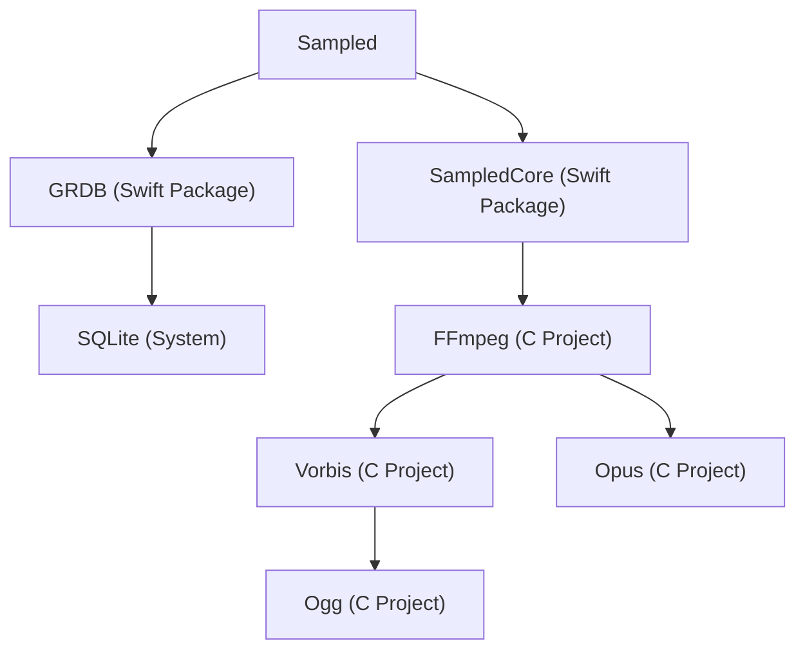
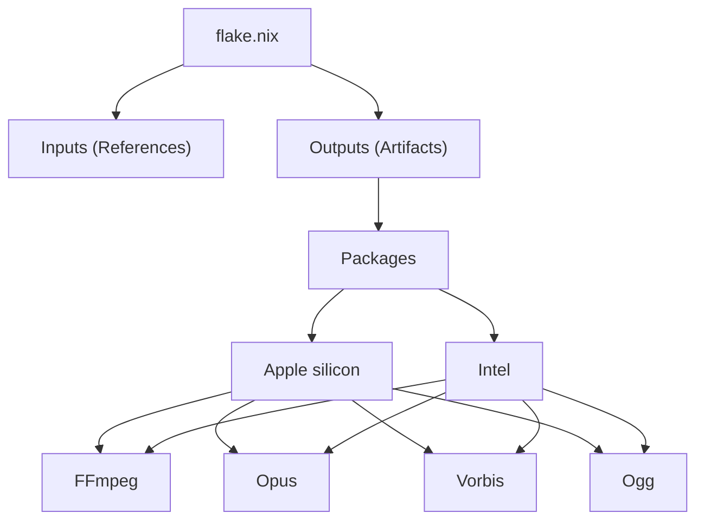

# Using Nix to Manage Swift Project Dependencies

I’m developing [Sampled, a macOS app empowering people to listen to music on their own terms](https://github.com/kyleerhabor/sampled). The project uses [FFmpeg](https://ffmpeg.org) for local processing, which is very fun to work with as a non-trivial C dependency. At the same time, it’s a pain to integrate into a Swift project, and the shell scripts I’ve used to manage it have been a source of friction.

Enter [Nix, a purely functional package manager and system configuration tool](https://nixos.org). Also some AI. I’ll walk through what I gained, where the rough edges are, and what it cost me. The migration took two days and cost ~$4 in AI usage. In return, I got a build process that works across architectures and rebuilds, without the orchestration I’d been maintaining. Before diving into the Nix specifics, it’s worth describing the original setup.

## Background

Sampled is maintained as an Xcode project and includes a number of dependencies. In general, there are project dependencies for simplifying what would otherwise be implemented in the Xcode project, and system dependencies for integrating with system services. For example, [GRDB](https://github.com/groue/GRDB.swift) is a project dependency that manages a local database Sampled maintains, which itself includes [SQLite](https://sqlite.org/index.html) as a system dependency for the underlying database system. SQLite ships with macOS, so it’s ideal to link against the system installation. For custom builds, [SQLite allows you to bring your own build system](https://sqlite.org/amalgamation.html), making it simple to include as a project dependency. This is great, but SQLite is the exception here, since most C projects aren’t shipped with the system, nor let you uproot their build systems.

In addition to Swift packages like GRDB, Sampled includes project dependencies for C projects like [Ogg](https://www.xiph.org/ogg), [Vorbis](https://xiph.org/vorbis), [Opus](https://www.opus-codec.org), and FFmpeg. A simplified view of Sampled's dependency graph looks like so:



Ogg, Vorbis, and Opus use [GNU Autotools](https://www.gnu.org/software/automake/manual/html_node/index.html) as their build systems, whereas FFmpeg rolls its own. In action, building each project looks like so:

```sh
./configure
make
make install
```

This configures the build (`./configure`), executes (`make`), and installs it for Sampled to use (`make install`). [This can be used to wrap C libraries in Swift](https://www.swift.org/documentation/articles/wrapping-c-cpp-library-in-swift.html), but requires you to manage the process yourself, since Swift Package Manager doesn’t offer first-class support for integrating other build systems. A lot of projects sidestep this by treating project dependencies like system ones—such as by using [Homebrew](https://brew.sh) to install to a system directory like `/usr/local`, then creating shim files to find the library—but this assumes you’re comfortable sharing Homebrew packages across projects, which is not ideal for customizing the build. Instead, [I wrote a suite of shell scripts to orchestrate the process](https://github.com/kyleerhabor/sampled/tree/dcd322f4c2c6bd4f29a749cdd5ffb30eacbe457c/Tools), and it worked, but was fragile.

## Using Nix

A few days before writing this, I was configuring my system to support secure connection between my MacBook Pro and iPhone over the local network with [Tailscale](https://tailscale.com). I was able to use [Caddy](https://caddyserver.com) as a reverse proxy to access services like [Navidrome](https://www.navidrome.org) and [Komga](https://komga.org) at `https://*.home.kyleerhabor.com` as an alternative to port numbers. The best part is that [I accomplished this with very little setup using Nix](https://github.com/kyleerhabor/nix-config/blob/7348b8e6dfe4d50d7b2eddf7f4c4d818d74f4b43/home/kyleerhabor.nix#L37-L75), so apart from Tailscale, Nix manages the dependencies and server processes in a way that works on any system.

Given how well Nix worked for my system, I started wondering whether I could apply this to managing C project dependencies in Sampled.

### Planning

The previously mentioned shell scripts were responsible for building C dependencies. The process was split into two phases: downloading, which pulled the source repository and checked out the source code, and building, which occurred locally. Each dependency owned its build process, so ones like Ogg, Vorbis, and Opus could build multiple architectures in parallel, while others like FFmpeg built x86 and ARM separately. The resulting artifacts were installed into a Swift package embedded in the Xcode project. Finally, the tool could be called by the user or Xcode, in which the latter used [run scripts for dependency analysis](https://developer.apple.com/documentation/xcode/running-custom-scripts-during-a-build).

This worked, but exhibited a number of issues.

Firstly, project dependencies were checked out at a commit, but their native dependencies (that is, dependencies for managing the build itself) were provided by Homebrew. In most cases, you can rely on the default installation of `autoconf`, `automake`, `libtool`, `pkg-config`, `nasm`, etc., but they’re moving targets, so if Homebrew ships an incompatible or bad release, your builds start failing.

Secondly, dependency analysis was limited to Xcode, meaning that user builds had to build every dependency, regardless of changes. Fortunately, this wasn’t much of an issue, since user builds were only required for bootstrapping. The worse angle was Xcode’s dependency analysis depending on files declared by the run script, meaning you had to list every file yourself, rather than let the script indicate what it touched. To add insult to injury, changes to the Xcode build configuration (e.g., building for release instead of debug) would change scripts’ parameters, requiring a full rebuild.

Thirdly, to ease the implementation, concurrency was limited to execution (`make`), leaving the dependency graph serial and concurrent calls to the tool unsafe. This was especially bad for Xcode, since the editor tries to prepare codebases in the background, which can interfere with, say, a user build in the meantime. I chose to guard against this:

```sh
if [ "$ACTION" = indexbuild ]; then
  # Xcode is preparing the editor by pre-building the project. A formal build takes a while and risks errors from
  # concurrently executing scripts, so we disallow this. A better solution would be to introduce locks.
  exit 0
fi
```

The guard still exists in the Nix implementation, but is purely for speed, not safety. There were other issues, but these were some of the more egregious ones.

In addition to using Nix, I wanted to get acquainted with AI in software development, since it looks like it’s here to stay (or, at least, some form of it). The last time I used it at work, I’d ask a question, find the answer suboptimal, and go back and forth before giving up and coding the solution myself, so I tried integrating modern features like skills and agents while keeping the AI under control. For example, there was an incident where an agent code-signed a binary in the Nix store to diagnose a problem, which is obviously evil in the Nix world, so [I generated a skill mandating agents limit themselves to non-destructive actions](https://github.com/kyleerhabor/dotfiles/blob/a81a2c676e46c36e9531f82d29a66afa53067ddd/.agents/skills/read-only-mode/SKILL.md).

As for the model, I chose [DeepSeek](https://www.deepseek.com/en)’s V4 Pro. I’m already familiar with their chatbot, and their pricing is competitive (\$0.003625/1M input tokens on cache hit, \$0.435/1M input tokens on cache miss, and \$0.87/1M output tokens), so it was a natural choice.

### Execution

The first step was to configure Nix for this project:

```sh
nix flake init
```

In the past, there was no standard for managing Nix projects, so you’d end up conjuring a worse version of [the flakes system](https://nixos.wiki/wiki/flakes). Now, you end up with `flake.nix`:

```nix
{
  description = "A very basic flake";

  inputs = {
    nixpkgs.url = "github:nixos/nixpkgs?ref=nixos-unstable";
  };

  outputs = { self, nixpkgs }: {

    packages.x86_64-linux.hello = nixpkgs.legacyPackages.x86_64-linux.hello;

    packages.x86_64-linux.default = self.packages.x86_64-linux.hello;

  };
}
```

You can build the flake:

```sh
nix build
```

This produces a symlink from `result` to `/nix/store/<hash>-hello-<version>`, and `flake.lock` which pins dependencies so others who run the command will see the same result. I wanted to apply this to macOS and our C dependencies, so I ended up with this at first:

```nix
{
  inputs = {
    nixpkgs.url = "github:NixOS/nixpkgs/nixpkgs-26.05-darwin";
  };
  outputs = { self, nixpkgs }: let
    systems = ["x86_64-darwin" "aarch64-darwin"];
    forDarwin = nixpkgs.lib.genAttrs systems;
  in {
    packages = forDarwin (
      system: let pkgs = nixpkgs.legacyPackages.${system}; in {
        libogg = pkgs.callPackage ./nix/packages/libogg.nix {};
        libvorbis = pkgs.callPackage ./nix/packages/libvorbis.nix {
          libogg = self.packages.${system}.libogg;
        };
        libopus = pkgs.callPackage ./nix/packages/libopus.nix {};
        ffmpeg = pkgs.callPackage ./nix/packages/ffmpeg.nix {
          libvorbis = self.packages.${system}.libvorbis;
          libopus = self.packages.${system}.libopus;
        };
      }
    );
  };
}
```

This has a lot of moving parts, but in summary, we’re using Nixpkgs for Apple platforms (`nixpkgs-26.05-darwin`, i.e., Darwin) and building our four dependencies as Nix packages on x86 (`x86_64-darwin`, i.e., Intel) and ARM (`aarch64-darwin`, i.e., Apple silicon). The structure of the flake looks like so:



If you try to build this for your system, it should work, but not produce a useful output. At the same time, building for other systems (e.g., ARM from x86) will fail because the architectures won’t match. For this, we’ll need cross compilation:

```nix
{
  ...
  outputs = { self, nixpkgs }: let
    ...
    pkgsFor = system:
      if system == builtins.currentSystem
      then nixpkgs.legacyPackages.${system}
      else nixpkgs.legacyPackages.${builtins.currentSystem}.pkgsCross.${system};
  in {
    packages = forDarwin (
      system: let pkgs = pkgsFor system; in {
        ...
      }
    );
  };
}
```

This branches on the system so building for another enables cross compilation. If you’re familiar with the process, you’ll know the build platform denotes what you’re building on (e.g., `x86_64-darwin`), the host platform denotes what the product runs on (e.g., `aarch64-darwin`), and that building for the same build and host platform represents native compilation. Building for the same system mostly fetches pre-built packages, but for some reason, the cache doesn’t cover cross-compiled packages, so Nix builds the entire platform (i.e., the cross-compiler and system libraries) from source before our dependencies. On my 2019 MacBook Pro, this takes ~40 minutes. As a side tangent, I thought indexing into `nixpkgs.legacyPackages.${builtins.currentSystem}.pkgsCross.${system}` with the same system would loop back to `nixpkgs.legacyPackages.${system}`, but it doesn’t. 😞

As for the dependencies themselves, Nix represents each one as a derivation—a build recipe that encodes its inputs, build steps, and outputs. In practice, I use `stdenv.mkDerivation`, which orchestrates the build lifecycle for C projects. By default, it looks for `./configure`, runs `make`, and finally `make install`. This allows me to provide the source, list the build tools, and have Nix manage the rest. For example, [Ogg is defined like so](https://github.com/kyleerhabor/sampled/blob/5e7415c392eeb1d09b6fc5825224963cc1dad2f7/nix/packages/libogg.nix):

```nix
{ stdenv, fetchFromGitLab, autoreconfHook, pkg-config }: stdenv.mkDerivation {
  name = "libogg";
  version = "v1.3.6+";
  strictDeps = true;
  src = fetchFromGitLab {
    domain = "gitlab.xiph.org";
    owner = "xiph";
    repo = "ogg";
    rev = "0288fadac3ac62d453409dfc83e9c4ab617d2472";
    hash = "sha256-IoDEoh58OqiixLu8n3N/G9Fzqm4WYoTuGZLTLGw7XfM=";
  };

  # Configure
  nativeBuildInputs = [autoreconfHook pkg-config];
  dontDisableStatic = true;
  configureFlags = [
    "--disable-shared"
  ];

  # Build
  enableParallelBuilding = true;
}
```

Here, we define `libogg`, which fetches the library’s source code from [Xiph’s self-hosted GitLab repository](https://gitlab.xiph.org/xiph/ogg) and uses Autotools as its underlying build system. [Vorbis’s definition is similar](https://github.com/kyleerhabor/sampled/blob/5e7415c392eeb1d09b6fc5825224963cc1dad2f7/nix/packages/libvorbis.nix), but depends on Ogg and requires a small patch:

```sh
{ stdenv, fetchFromGitLab, ..., libogg }: stdenv.mkDerivation {
  name = "libvorbis";
  version = "v1.3.7+";
  ...
  src = fetchFromGitLab {
    ...
    repo = "vorbis";
    rev = "2d79800b6751dddd4b8b4ad50832faa5ae2a00d9";
    hash = "sha256-zpV37LIq571Z0li+Prqu3Zcb0I4Y4iLC8u58udadNnE=";
  };

  # Configure
  ...
  propagatedBuildInputs = [libogg];
  ...
  postAutoreconf = ''
    # Remove obsolete -force_cpusubtype_ALL option so it's not passed to ld.
    #
    # https://github.com/Homebrew/homebrew-core/blob/35ebe9ef7f7f78c7e5ca425b6c90415c608788ab/Formula/lib/libvorbis.rb#L49
    substituteInPlace configure --replace-fail '-force_cpusubtype_ALL' ""
  '';

  # Build
  ...
}
```

While [Opus’s definition is similar to Ogg’s](https://github.com/kyleerhabor/sampled/blob/5e7415c392eeb1d09b6fc5825224963cc1dad2f7/nix/packages/libopus.nix), [FFmpeg's requires us to implement the configure phase since it doesn’t use Autotools:](https://github.com/kyleerhabor/sampled/blob/5e7415c392eeb1d09b6fc5825224963cc1dad2f7/nix/packages/ffmpeg.nix)

```nix
{ stdenv, lib, buildPackages, fetchgit, pkg-config, nasm, libvorbis, libopus }: let
  demuxers = [...];
  decoders = [...];
in stdenv.mkDerivation {
  name = "ffmpeg";
  version = "8.0+";
  ...
  src = fetchgit {
    url = "https://git.ffmpeg.org/ffmpeg.git";
    rev = "1c7b72cd6b16f344d40bb63d33338cb06c12aed2";
    hash = "sha256-b0mtYrZJwnWsNmGGFj/Bdrzk9/VTHz2xZWHPkW7vWnI=";
  };

  # Configure
  nativeBuildInputs = [pkg-config]
    ++ lib.optionals stdenv.hostPlatform.isx86 [nasm];
  buildInputs = [libvorbis libopus];
  ...
  configurePlatforms = [];
  configureFlags = [
    # Configuration
    ...

    # Programs
    ...

    # Documentation
    ...

    # Components
    "--enable-demuxer=${builtins.concatStringsSep "," demuxers}"
    "--enable-decoder=${builtins.concatStringsSep "," decoders}"
    ...

    # External libraries
    "--enable-libopus"
    "--enable-libvorbis"

    # Toolchain
    "--arch=${stdenv.hostPlatform.parsed.cpu.name}"
    "--target-os=${stdenv.hostPlatform.parsed.kernel.name}"
    "--pkg-config-flags=--static"
  ]
  ++ lib.optionals (stdenv.hostPlatform != stdenv.buildPlatform) [
    # Toolchain
    "--enable-cross-compile"
    "--cross-prefix=${stdenv.cc.targetPrefix}"
    "--host-cc=${buildPackages.stdenv.cc}/bin/cc"
  ];
  configurePhase = ''
    runHook preConfigure
    ./configure --prefix=$out --cc=$CC $configureFlags
    runHook postConfigure
  '';

  # Build
  ...
}
```

Sampled only needs to support decoding audio files, so we limit the build to demuxers for container formats (i.e., Ogg) and decoders for audio formats (i.e., Vorbis and Opus). In the future, I plan to include filters for processing decoded audio, which should allow me to support standards like ReplayGain for loudness normalization. FFmpeg implements many formats itself, so ones like Ogg aren’t direct dependencies. While developing this, I was confused as to why [FLAC](https://xiph.org/flac) is not a required dependency despite including it, and was surprised to find it reimplemented after letting the AI scan the codebase.

Notice that we’re responsible for wiring cross compilation ourselves, whereas Ogg, Vorbis, and Opus handle this transparently. In addition, the only option we’ve set for the build phase is parallel building for the compiler, letting Nix manage the rest. We haven’t even touched the install phase! In the end, producing useful outputs involves writing a few symlinks from the embedded Swift package to the Nix store:

```nix
{
  ...
  outputs = { self, nixpkgs }: let
    ...
  in {
    packages = forDarwin (
      system: let pkgs = pkgsFor system; in {
        ...
        cffmpeg-support = pkgs.buildPackages.runCommand "cffmpeg-support" {} "cp -R ${./SampledCore/Sources/CFFmpegSupport}/. $out";
        cffmpeg = pkgs.symlinkJoin {
          name = "cffmpeg";
          paths = [
            self.packages.${system}.cffmpeg-support
            self.packages.${system}.ffmpeg
          ];
        };
      }
    );
    ...
  };
}
```

[`SampledCore/Sources/CFFmpegSupport` contains supporting files for the Swift package.](https://github.com/kyleerhabor/sampled/tree/5e7415c392eeb1d09b6fc5825224963cc1dad2f7/SampledCore/Sources/CFFmpegSupport) Aside from some setup scripts, this completes the core of our Nix integration.

### Results

[You can review the source code in the GitHub repository.](https://github.com/kyleerhabor/sampled) The implementation is ~425 lines of code, whereas the old one was ~475 lines. The difference may not look like much, but when you consider that Nix manages [source integrity](https://nixos.wiki/wiki/Nix_Hash), a dependency graph for building packages concurrently, cross compilation, caching, etc., an equivalent suite would be over 1,000 lines, and still a worse version of Nix.

As for AI, I chose to use it as an assistant, letting it read my codebase, run terminal commands, fetch information online, etc., but not write code on my behalf. I’m skeptical about granting it uncontrolled write access since I don’t trust it to make good design decisions. I found it useful for debugging most issues, like answering why `pkg-config` couldn’t find Vorbis’s Ogg dependency when specified via `buildInputs` (it’s not transitive, unlike `propagatedBuildInputs`).

The whole system took two days to complete, and cost me ~$4. I could’ve done it without AI, but it likely would’ve taken me four days to a week and produced identical results. I think the real consequence is that I didn’t learn Nix as much as I would’ve on my own. I’ve learned enough that I understand the language and ecosystem, but not enough to be a contributor. At the same time, I doubt I’ll have the free time in the future to work on ambitions of this scale, so absorbing enough information to confidently fact-check the AI may be a reasonable compromise.

I think using AI as an assistant will be the most viable approach in an AI world. In those few days, I used 246M input tokens on cache hits, 5.3M input tokens on cache misses, and 925K output tokens. I did notice that my usage looked off at one point, which I suspect to be a bug in [Zed](https://zed.dev), but found workarounds for (removing old conversations and not running very long ones). I know many who use the latest and greatest models, but they pay a premium. I suspect it's more sustainable to bring your own domain knowledge and let the AI accelerate what you already know how to do.

## Future Plans

The Nix implementation is much more resilient, but not without its flaws. On my 2019 MacBook Pro, calling it raises this warning:

```sh
evaluation warning: Nixpkgs 26.05 will be the last release to support x86_64-darwin; see https://nixos.org/manual/nixpkgs/unstable/release-notes#x86_64-darwin-26.05
```

This is due to `x86_64-darwin` being deprecated as a build platform. By the end of the year, I hope to upgrade to Apple silicon, but would still like Sampled to support development on Intel.

There are two possible interpretations of this message. The first is that `x86_64-darwin` as a build platform is deprecated, but the host platform will still exist for cross compilation. The second is that it’s deprecated as a platform, meaning that host builds are unsupported, too. If it’s the former, I can spin up a CI to distribute cross-compiled builds to developers on Intel. If it's the latter, I'll have to either pin Nixpkgs to 26.05 and hope nothing breaks, or fall back to shell scripts, which would undo a lot of the gains. This wouldn’t be great, but I’d still be able to apply what I’ve learned to build a more resilient suite that lasts a long time.

Another issue is that cross compiling is slow. This could easily be solved with a CI that caches builds, but that slows down setup in the event of parameter changes. I’m less worried about this, but it’s nevertheless important to think about.

Finally, the pressing issue at heart is developing Sampled, which I project to take months, if not a year. I’m experimenting with adding support for [OpenSubsonic](https://opensubsonic.netlify.app) servers like Navidrome, plus have ideas for simplifying the implementation. The issue is that I’m working on borrowed time, and may end up pre-occupied with another hobby. At the very least, I hope the sample implementation will be useful to other developers.

In my opinion, if you’re working on a project and have dependencies which can’t be managed by your native package manager, you should give Nix a try. If you roll your own system, it may be easy to set up, but hard to maintain. Projects like Nix have already addressed most of the pain points and let you focus on what matters in your project.
